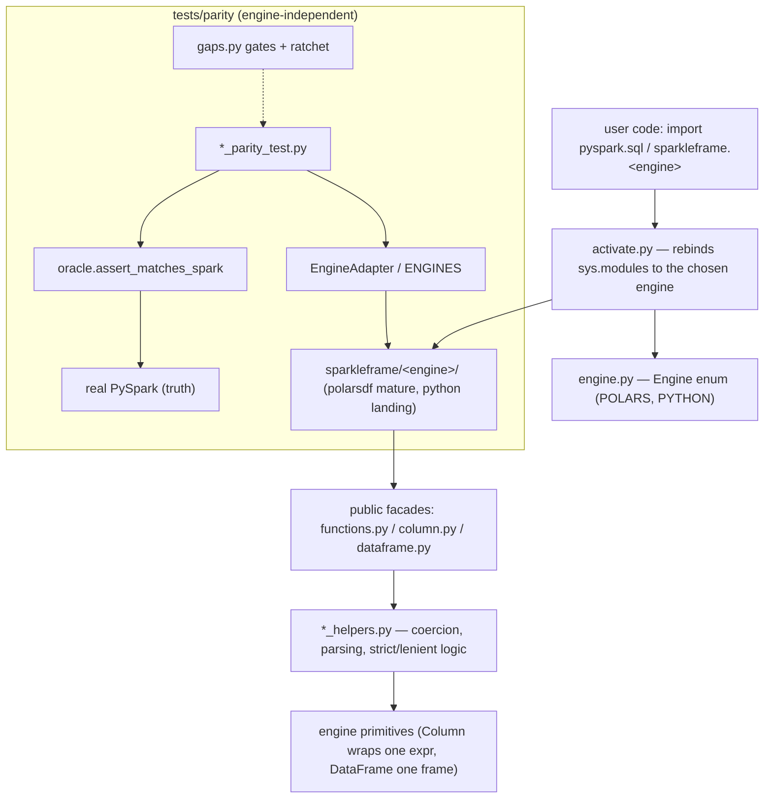

# Architecture

> A bird's-eye codemap of SparkleFrame: where things live and how the coarse pieces
> relate. It names files and types but does not link them — use symbol search to jump
> to anything named here. It is revisited a few times a year, not kept in lock-step with
> the code, so it deliberately avoids line numbers and per-module implementation detail.
> For *how to work in* an area, follow the guides under `docs/contributing/`.

## The problem

PySpark's DataFrame API is the lingua franca for data pipelines, but running it requires a
Spark/JVM cluster — heavy to start, slow for small or low-latency recomputation. SparkleFrame
re-implements that API surface so the **same PySpark code** runs on a lightweight local
**engine** instead. It is a partial shim aimed at Spark 4.x: behavior matches Spark where
implemented, verified against real Spark.

## Codemap

### Engine selection — the outermost seam

`sparkleframe/engine.py` defines `Engine`, the enum of engines. Each member carries a package
name and a class-name prefix (`POLARS = ("polarsdf", "Polars")`, `PYTHON = ("python", "Python")`).
`Engine` is re-exported from the package root (`sparkleframe/__init__.py`).

`sparkleframe/activate.py` is how `import pyspark` starts resolving to SparkleFrame. `activate()`
installs a mock `pyspark` into `sys.modules`, then rebinds `pyspark.sql` (and submodules like
`pyspark.sql.functions`) to the selected engine's package, stripping the engine's class prefix
(`PolarsDataFrame` → `DataFrame`). `deactivate()` restores the real modules; `activate_context()`
is the scoped form. Users can also import an engine package directly and skip activation entirely.

### An engine package — the API surface

An engine lives under `sparkleframe/<engine>/`. Polars is the mature engine
(`sparkleframe/polarsdf`); `sparkleframe/python` is scaffolded and landing incrementally (#102).
Within a package, the public
modules are **thin facades** and all real logic sits in a matching `*_helpers.py`. That split is
an invariant, not a style preference (see Invariants below).

Both engines share this layout (`<engine>` is `polarsdf` or `python`):

| File (in `sparkleframe/<engine>/`) | Responsibility |
|---|---|
| `__init__.py` | Exports `Column`, `DataFrame`, `SparkSession`, `Window`, `WindowSpec`, `functions` |
| `session.py` | `SparkSession` — builder + `createDataFrame`; the entry point |
| `dataframe.py` | `DataFrame` — wraps the engine frame; `select`/`filter`/`join`/`groupBy`/… |
| `dataframe_helpers.py` | Shared frame logic — join mapping, value/row conversion |
| `column.py` | `Column` — wraps one engine expression; arithmetic, comparison, cast, getItem |
| `column_helpers.py` | Type validation/coercion, comparison guards, strict/lenient cast helpers |
| `functions.py` | `pyspark.sql.functions` surface (`col`, `lit`, `to_timestamp`, `element_at`, …) |
| `functions_helpers.py` | Date/time parsing, JSON/struct, array/map helpers — each with a `strict` flag |
| `group.py` | `GroupedData` — aggregations after `groupBy` |
| `window.py` | `Window` / `WindowSpec` — partition/order/frame for `over()` |
| `types.py` | DataType handling — Polars keeps a name↔type registry; Python consumes PySpark types directly |

Engine-specific additions:

- **`polarsdf/`** adds `types_utils.py` (Map↔Struct materialization, schema-cast application).
- **`python/`** adds `_errors.py` (the uniform `not_implemented_yet`) and the **`ast/`** package —
  `expressions.py` (unresolved build nodes), `analyzer.py`, `evaluator.py`, `coercion.py` — which
  implements the build → analyze → evaluate flow described below.

`sparkleframe/base/dataframe.py` holds the engine-independent `DataFrame` base (e.g.
`to_native_df`).

### How a call flows

`Column` wraps a **single** engine expression; `DataFrame` wraps a **single** engine frame. A
PySpark call like `col("a") + col("b")` builds a `Column` around the engine's expression. This
wrapper pair is the **seam where Spark semantics meet engine primitives** — where Spark coercion
and ANSI-strictness are imposed on top of the underlying engine. The two engines sit that seam at
different times: the **Polars** engine resolves types at *expression-build time* (the public
operator delegates to a `column_helpers` routine immediately), evaluating when the `DataFrame`
operation runs; the **Python** engine splits the work into three phases (below).

### The Python engine — build → analyze → evaluate

The `python` engine mirrors Spark's Catalyst flow instead of resolving types eagerly. Its `ast/`
package carries the three phases:

1. **Build** — constructing `col("a") + col("b")` produces an *unresolved* node
   (`ast/expressions.py`); zero type decisions, no schema needed.
2. **Analyze** (`ast/analyzer.py`, `ast/coercion.py`) — when the expression meets a schema-bearing
   `DataFrame`, the tree is resolved against that `StructType`: each node's `data_type` is filled
   and Spark coercion `Cast` nodes are inserted (e.g. `numeric + string` → cast the string to
   double). Because the schema is in hand here, the build-time "dtype unknown" limitation behind
   most of `docs/known_gaps.md` **cannot occur** — that is the engine's reason to exist.
3. **Evaluate** (`ast/evaluator.py`) — run the resolved tree over the rows.

Today a transform analyzes then evaluates immediately; *when* `evaluate` fires relative to building
a transform chain (an eager-vs-lazy flag) is a `DataFrame`-layer decision noted but not yet built.
Detail and decisions live in `docs/design/python-engine-ast.md`.

### The parity harness — proving it matches Spark

`sparkleframe/tests/parity/` is engine-independent and is the second half of the architecture.

- `engines.py` — `EngineAdapter`, the *only* place tests touch a concrete engine, plus the
  `ENGINES` dict keyed by `Engine`. An engine that isn't scaffolded yet is `None`.
- `oracle.py` — `assert_matches_spark`, the single definition of "does this match real Spark?"
  It reads results through the adapter, normalizes, and compares (multiset by default).
- `conftest.py` — the `engine` fixture parametrizes every parity test over all engines; gated
  behaviors `xfail` and unscaffolded engines skip.
- `gaps.py` — per-engine "not supported yet" gate sets and the `PYTHON_GATE_HIGH_WATER_MARK`
  ratchet; `gate_ratchet_test.py` enforces that the gate only shrinks.

The mechanics and the gate-shrinking workflow live in `docs/contributing/engines.md` and
`docs/contributing/testing.md`.

## Codemap diagram

## Invariants (what must stay true)

- **The shared, test, and oracle layers never import a concrete engine package directly.** They
  reach an engine only through `EngineAdapter` / the `Engine` enum. This is what keeps a second
  engine viable. (Noted exception: the oracle currently borrows normalization helpers from
  `tests/utils`, which transitively touch `polarsdf` — see the comment in `oracle.py`.)
- **Public modules carry no engine-coercion logic inline.** `functions`/`column`/`dataframe` are
  facades; coercion, parsing, and validation live in `*_helpers.py`. The helper is the boundary.
- **No Spark 3 semantics.** ANSI-strict is the default; strict APIs never delegate to their
  `try_*` siblings.
- **The parity gate only shrinks.** A behavior is "promoted" from optional to required by deleting
  its id from a gate set — never by re-gating a regression.

## Cross-cutting concerns

- **Spark 4 ANSI strict vs lenient.** Strict/lenient pairs share one helper with a `strict` flag.
  The rules and the `element_at`/`try_element_at` map-key subtlety (SPARK-48766) are in
  `docs/contributing/spark4-semantics.md`.
- **Type coercion timing — the present-day constraint.** The Polars engine resolves column dtypes
  at *expression-build time*, before the frame schema is known. Cross-type coercion (e.g.
  `col(float) + col(string)`) therefore can't fire for bare column references, which is the root
  cause behind most of `docs/known_gaps.md`. Engines are free to resolve types differently behind
  the `EngineAdapter` / `Engine` boundary. The `python` engine resolves this differently — it
  resolves types in an analyze phase once the schema is known, so the `numeric + string` coercion
  fires where Polars can't — see `docs/design/python-engine-ast.md` and #104.
- **Multiple engines.** The canonical name for the pure-Python engine is **`python`**
  (package `sparkleframe/python/`), consistent across `engine.py`, `gaps.py`, and the docs
  generator. Note: issues #102/#104 and the `feature/pythondf-backend` branch use `pythondf`; those
  external references should be reconciled to `python`.
